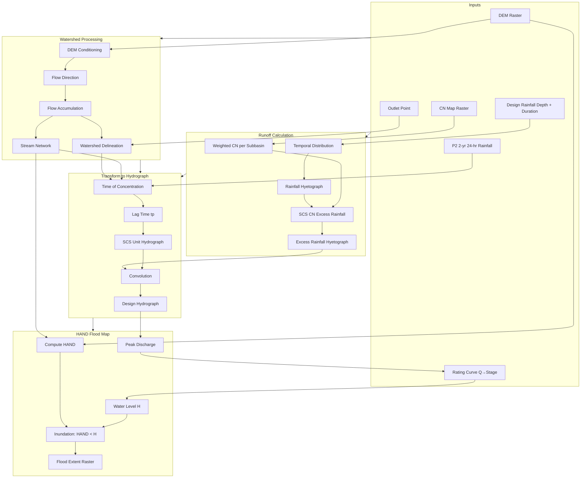

# Hypothetical Storm Hydrograph Calculator

## Architecture Overview



## Data Flow Summary

| Step                  | Input                             | Output                                |
| --------------------- | --------------------------------- | ------------------------------------- |
| Watershed delineation | DEM, outlet point, snap threshold | Watershed mask, area, stream network  |
| CN aggregation        | CN map, watershed mask            | Weighted curve number                 |
| Design hyetograph     | Rainfall depth, duration, pattern | Rainfall hyetograph (mm per timestep) |
| Excess rainfall       | Hyetograph, CN                    | Excess rainfall hyetograph            |
| Time of concentration | Watershed, DEM, stream net, P2     | Tc (hr), lag (min)                    |
| Unit hydrograph       | Area, Tc, PRF                     | SCS dimensionless UH ordinates        |
| Convolution           | Excess rainfall, UH               | Design hydrograph (Q vs t)            |
| HAND computation      | DEM, stream network               | HAND raster (m elevation above drainage) |
| Q-to-stage            | Peak discharge, rating curve      | Water level H (m)                    |
| Flood extent          | HAND raster, water level H        | Inundation raster (depth or binary)   |

---

## Technical Step Descriptions

### DEM conditioning
Remove drainage artifacts from the raw DEM using pysheds: `fill_pits(dem)` → `fill_depressions(pit_filled)` → `resolve_flats(flooded)`. `resolve_flats` accepts `max_iter` (default 1000) and `eps` (default 1e-5); increase `max_iter` for large grids if new pits appear. Produces a hydrologically correct elevation grid for flow routing.

### Flow direction & accumulation
Assign D8 or D-infinity flow direction from each cell to its steepest downslope neighbor. Accumulation counts upstream cells (or weighted sum) per cell. Used for stream detection and pour-point snapping. *Source: O'Callaghan & Mark 1984; Jenson & Domingue 1988.*

### Pour-point snapping
Snap user outlet (x, y) to the nearest cell where `acc > threshold` so delineation starts on a real drainage path. Avoids outlets in pits or low-flow cells.

### Watershed delineation
Trace upstream from the snapped pour point using flow direction; mark all cells that drain to it. Returns a boolean mask and area (cells × cell size²).

### Stream network extraction
Apply mask `acc > threshold` to identify channel cells; trace connected segments from flow direction. Returns GeoJSON of stream polylines.

### CN aggregation
Clip CN raster to watershed mask; compute area-weighted mean: `CN_eff = Σ(CN_i × A_i) / ΣA_i` over watershed cells. **Raster alignment:** CN and watershed must share CRS and extent. If resolution differs, resample CN to DEM grid (e.g., `rasterio.warp.reproject`) before masking. Exclude NoData.

### Design hyetograph
Distribute total design rainfall depth over duration using dimensionless cumulative fractions (SCS Type I/II/III or uniform). **Duration note:** SCS Type I/II/III are defined for 24-hour storms; for other durations (e.g., 6 h), scale the 24-h cumulative distribution to the target duration, or use uniform. Output: array of rainfall depth (mm) per timestep. *Source: TR-55 Appendix B; rainfall depths from NOAA Atlas 14.*

### Excess rainfall (SCS CN)
For each timestep: accumulate `P`; compute cumulative excess `Pe = (P - 0.2S)²/(P + 0.8S)` when `P > Ia` (Ia = 0.2S), else Pe = 0; take incremental excess as `ΔPe = Pe(t) - Pe(t-1)`. Use Pe (excess rainfall depth), not Q (discharge), to avoid symbol confusion. Output: excess rainfall hyetograph (mm per timestep). *Source: SCS NEH-4, TR-55.*

### Time of concentration
**Flow path:** Longest flow path from watershed boundary to outlet. Segment into: (1) sheet flow (≤100 m / 300 ft); (2) shallow concentrated flow (next ~300 m); (3) channel flow to outlet. **Sheet flow (English):** `t_sheet = 0.007(nL)^0.8/(P2^0.5 S^0.4)` (hr); L in ft, max 300 ft; P2 in in; S in ft/ft. **SI conversion:** use P2 in mm (1 in = 25.4 mm), L in m (1 ft = 0.3048 m); or apply FHWA metric form `t = (6.943/i^0.4)(nL/√S)^0.6` with i in mm/hr. **Shallow/channel:** velocity-based `t = L/V`; shallow: `V = 16.13√S` (unpaved) or `20.33√S` (paved) ft/s; channel: Manning `V = (1.49/n)R^(2/3)S^(1/2)` ft/s. Output: Tc (hr), lag `tp = 0.6 × Tc` (min). *Source: TR-55, FHWA HEC-22.*

### SCS unit hydrograph
Compute `Tp = tr/2 + tp` (tr = timestep duration); `Qp = 0.208 × A × PRF / Tp`. Scale dimensionless ordinates (q/qp vs t/Tp) by Qp. **Volume check:** For 1 mm excess over area A (m²), total runoff volume = A × 10⁻³ m³; ensure Σᵢ UH[i] × Δt (s) × 10⁻³ m/mm ≈ A × 10⁻³ m³ (i.e., UH ordinates in m³/s per mm excess). Output: UH ordinates (m³/s per mm excess) at timestep resolution. *Source: NRCS NEH-4/Part 630, TR-55.*

### Convolution
Convolve excess rainfall hyetograph with unit hydrograph: `Q(t) = Σᵢ excess[i] × UH(t − i·Δt)` where i indexes timesteps and UH is zero-padded for t < 0. Use `np.convolve(excess, uh, mode='full')` or manual loop. Output: design hydrograph (Q in m³/s vs t in min).

### HAND (Height Above Nearest Drainage)
Compute elevation of each cell above the nearest drainage channel. For each cell: trace flow path downstream to stream; HAND = cell elevation − stream elevation at confluence. **Use conditioned DEM** (after fill_pits, fill_depressions, resolve_flats)—same DEM used for flow direction. Uses flow direction and stream mask. Output: HAND raster (m), same extent as DEM. *Source: Rennó et al. 2008; Nobre et al. 2011.*

### Q-to-stage (rating curve)
Convert peak discharge from design hydrograph to water surface elevation. Options: (1) user-supplied rating curve (Q vs stage table or function); (2) Manning-based uniform flow approximation for simple channels via `src.rating_curve` (rectangular, trapezoidal); (3) pass-through if user provides stage directly. Output: design water level H (m).

### Flood extent (HAND thresholding)
For design water level H: inundated cells = `HAND < H`; inundation depth = `H − HAND` where inundated. Output: flood extent raster (binary or depth), GeoTIFF.

---

## Implementation Plan

### 1. Project Setup

- **Python 3.10+** with `requirements.txt`:
  - `pysheds` — DEM processing, flow direction, watershed delineation, stream extraction
  - `rasterio` — Geospatial raster I/O (DEM, CN map)
  - `numpy`, `pandas` — Arrays and tabular data
  - `scipy` — Convolution, interpolation
  - `geopandas` (optional) — Outlet point and vector handling
  - `matplotlib` — Plotting
- **Project structure:**

```
simple-hms/
├── src/
│   ├── watershed.py      # DEM, delineation, stream network, Tc, GeoJSON export
│   ├── rainfall.py       # Design storm, temporal distribution
│   ├── runoff.py         # SCS CN excess rainfall
│   ├── unit_hydrograph.py # SCS UH generation
│   ├── hydrograph.py     # Convolution, main pipeline
│   ├── rating_curve.py   # Q-stage from Manning's equation (rectangular, trapezoidal)
│   ├── flood_map.py      # HAND, Q-to-stage, inundation extent, progress callback
│   ├── plot.py           # Hydrograph plotting (rainfall, excess, flow)
│   ├── gui.py            # Tkinter GUI: flood map + hydrograph, layer toggles
│   └── utils.py          # Unit conversions, helpers
├── data/                 # DEM, CN map, outlet, rating curve (placeholder)
│   ├── dem.tif           # Example DEM (HEC Pistol Creek)
│   ├── cn.tif            # Example CN raster (HEC Pistol Creek)
│   └── PistolCreek_extracted/  # Full HEC tutorial archive
├── outputs/              # hydrograph.png, flood_map.tif, watershed.geojson, etc.
├── .vscode/
│   └── launch.json       # Python: example.py, Python: GUI
├── requirements.txt
├── PLAN.md
├── README.md
└── example.py            # CLI + GUI entry point
```

### Example Data

Example DEM and CN rasters from the HEC website are provided in `data/` for testing:

| File     | Source                    | Size   | Description                                                                 |
| -------- | ------------------------- | ------ | --------------------------------------------------------------------------- |
| `dem.tif`| HEC Pistol Creek tutorial | ~5.5 MB| Elevation raster (`elevation.tif`) from Pilot Creek watershed (~12 mi S of Knoxville, TN) |
| `cn.tif` | HEC Pistol Creek tutorial | ~591 KB| SCS Curve Number grid (`CNgrid.tif`)                                        |

**Source:** [HEC-HMS Importing Gridded SCS Curve Number](https://www.hec.usace.army.mil/confluence/hmsdocs/hmsguides/gis-tools-and-terrain-data/gis-tutorials-and-guides/importing-gridded-scs-curve-number-in-hec-hms) — Download `PistolCreek_Tutorial.7z`; extract and copy `gis/PistolCreek/elevation.tif` → `dem.tif`, `gis/CNgrid.tif` → `cn.tif`.

**Outlet coordinates:** Obtain from `data/PistolCreek_extracted/PistolCreek_Tutorial/gis/PistolCreek_Watershed.shp` or use a point within the watershed boundary. DEM and CN may have different resolutions; resample CN to DEM grid if needed (see CN aggregation notes).

---

### 2. Watershed Module (`watershed.py`)

**Responsibilities:** DEM conditioning, delineation, stream network, time of concentration.

- **DEM conditioning:** Three-step pysheds sequence: `fill_pits()` → `fill_depressions()` → `resolve_flats()`
- **Flow direction:** D8 or D-infinity
- **Flow accumulation:** Upstream cell count
- **Pour point snapping:** `grid.snap_to_mask(acc > threshold, (x, y))` returns snapped (x, y); use before delineation. Handles outlets off drainage.
- **Watershed delineation:** `grid.catchment(x=x_snap, y=y_snap, fdir=fdir, xytype='coordinate')` returns catchment mask.
- **Stream network:** `extract_river_network(fdir, acc > threshold)` — mask-based, returns GeoJSON
- **Time of concentration (Tc):** Flow path = longest path from watershed boundary to outlet. Segment: sheet (≤100 m), shallow (next ~300 m), channel (to outlet). SCS/TR-55 formulas:
  - Sheet flow: `t_sheet = 0.007 * (n*L)^0.8 / (P2^0.5 * S^0.4)` (hr); L in ft, max ~300 ft; P2 = 2-year 24-hr rainfall (in)
  - Shallow flow: `V = 16.13 * sqrt(S)` (unpaved) or `20.33 * sqrt(S)` (paved), ft/s; then `t = L/V`
  - Channel flow: Manning's equation `V = (1/n) * R^(2/3) * S^(1/2)`, then `t = L/V`
  - `Tc = t_sheet + t_shallow + t_channel`
- **Lag time:** `tp = 0.6 * Tc` (minutes)
- **Watershed area:** From delineated mask and cell size

**Key API:**

```python
@dataclass
class WatershedResult:
    mask: np.ndarray       # boolean, True = in watershed
    area_km2: float
    cell_size: float       # m or same as DEM
    transform: Affine
    snapped_outlet: tuple[float, float]
    # Additional: dem, fdir, acc, dem_conditioned, stream_network, grid (for HAND, Tc)

def delineate_watershed(
    dem_path: str, outlet_x: float, outlet_y: float, snap_threshold: int = 500
) -> WatershedResult

def extract_stream_network(fdir: np.ndarray, acc: np.ndarray, threshold: int = 100) -> dict  # GeoJSON

def compute_time_of_concentration(
    watershed_mask: np.ndarray, dem: np.ndarray, stream_network: dict,
    p2_24hr_mm: float, cell_size: float,
    fdir=None, acc=None, transform=None, snapped_outlet=None,
    stream_threshold: int = 500, n_manning: float = 0.05,
    shallow_paved: bool = False, channel_r_m: float = 0.3
) -> tuple[float, float]  # (Tc_hr, lag_min)
```

---

### 3. Rainfall Module (`rainfall.py`)

**Responsibilities:** Design storm temporal distribution and hyetograph.

- **SCS Type I, IA, II, III:** Dimensionless cumulative fractions from NRCS NEH Table 4-2 / TR-55 Appendix B. Type II: peak intensity near hour 12; ~73% of depth between hours 11–13. Type I/IA: Pacific NW; Type III: Gulf/southeastern US.
- **Uniform:** Constant intensity = depth / duration.
- **User-specified:** Pass `np.ndarray` of incremental rainfall (mm) per timestep; bypasses built-in patterns.
- **Non-24h duration:** For SCS patterns with duration ≠ 24 h, scale the 24-h cumulative distribution to target duration, or use uniform.
- **Output:** 1D array of rainfall depth (mm) per timestep; length = ceil(duration_hr × 60 / timestep_min).

**Key API:**

```python
def create_design_hyetograph(
    depth_mm: float, duration_hr: float,
    pattern: str | np.ndarray = 'type2',  # 'type1'|'type1a'|'type2'|'type3'|'uniform' or array
    timestep_min: int = 15
) -> np.ndarray  # shape (n_timesteps,), dtype float, units mm
```

---

### 4. Runoff Module (`runoff.py`)

**Responsibilities:** SCS Curve Number excess rainfall.

- **S from CN:** `S = 25400/CN - 254` (mm) or `S = 1000/CN - 10` (inches)
- **Initial abstraction:** `Ia = 0.2 * S`
- **Excess rainfall (incremental):** For each timestep, accumulate P; compute cumulative excess `Pe = (P - 0.2S)²/(P + 0.8S)` when P > Ia (Ia = 0.2S), else Pe = 0; incremental excess = `Pe[i] - Pe[i-1]`. Use Pe (depth) not Q to avoid confusion with discharge.
- **CN aggregation:** Zonal mean or area-weighted mean of CN within watershed mask

**Key API:**

```python
def compute_excess_rainfall(
    hyetograph_mm: np.ndarray, cn: float
) -> np.ndarray  # incremental excess (mm) per timestep, same length as hyetograph
# timestep_min not needed for SCS formula; hyetograph already has per-step depths

def aggregate_cn(
    cn_raster_path: str, watershed_mask: np.ndarray,
    transform, shape  # from DEM; resample CN to DEM grid if resolution differs
) -> float  # area-weighted mean CN
```

---

### 5. Unit Hydrograph Module (`unit_hydrograph.py`)

**Responsibilities:** SCS dimensionless unit hydrograph.

- **Tp:** `Tp = tr/2 + tp` (tr = timestep duration in same units as tp; tp = lag in min → convert to hr for Tp).
- **Qp (SI):** `Qp = 0.208 × A × PRF / Tp`; A in km², Tp in hr, Qp in m³/s. PRF ≈ 484 (standard); 100–600 for flat–steep terrain.
- **Dimensionless UH:** Standard NRCS ordinates (q/qp vs t/Tp). ~37.5% volume before peak; time base ≈ 5×Tp. Sample ordinates: t/Tp=0→0, 0.5→0.47, 1.0→1.0, 1.5→0.68, 2.0→0.28, 5.0→0.
- **Discrete ordinates:** Interpolate dimensionless curve to timestep resolution; scale by Qp; normalize so sum(UH)×timestep = 1 mm runoff volume (i.e., UH in m³/s per mm excess).

**Key API:**

```python
def scs_unit_hydrograph(
    area_km2: float, lag_min: float, timestep_min: int, prf: float = 484
) -> np.ndarray  # UH ordinates (m³/s per mm excess), length ~5×Tp/timestep
```

---

### 6. Hydrograph Module (`hydrograph.py`)

**Responsibilities:** Convolution and main pipeline.

- **Convolution:** `Q(t) = Σᵢ excess[i] × UH(t − i·Δt)`; use `np.convolve(excess, uh, mode='full')` or equivalent.
- **Main pipeline:** Delineate watershed → aggregate CN → create hyetograph → excess rainfall → compute Tc/lag → SCS UH → convolve → return DataFrame.

**Key API:**

```python
def compute_design_hydrograph(
    dem_path: str, cn_path: str, outlet_x: float, outlet_y: float,
    design_depth_mm: float, duration_hr: float, pattern: str = 'type2',
    p2_24hr_mm: float = 50, timestep_min: int = 15, prf: float = 484,
    snap_threshold: int = 500, watershed=None,
    base_flow_m3s: float | None = None, base_flow_recession_k_min: float | None = None
) -> pd.DataFrame  # columns: time_min, flow_m3s, rainfall_mm, excess_mm, [base_flow_m3s]
```

---

### 7. Flood Map Module (`flood_map.py`)

**Responsibilities:** HAND computation, discharge-to-stage conversion, inundation extent from design rainfall and duration.

- **HAND computation:** For each cell, trace flow path downstream to nearest stream cell; HAND = elevation(cell) − elevation(stream_at_confluence). **Input:** Conditioned DEM (same as used for flow direction), flow direction, stream mask. Output: HAND raster (m).
- **Q-to-stage:** Accept (1) user rating curve (array of (Q, stage) pairs, interpolate); (2) Manning-based rating curves from `src.rating_curve` for rectangular/trapezoidal channels; (3) direct stage input. Use peak Q from hydrograph.
- **Flood extent:** Threshold HAND by stage: `inundated = HAND < H`; depth = `H − HAND` where inundated. Clip to watershed mask. Output: GeoTIFF (binary extent or depth raster).

**Key API:**

```python
def compute_hand(
    dem_conditioned: np.ndarray, flow_dir: np.ndarray, stream_mask: np.ndarray
) -> np.ndarray  # HAND raster; dem_conditioned = after fill_pits/depressions/flats
def discharge_to_stage(peak_q_m3s, rating_curve=None, stage_m=None) -> float  # m
def compute_flood_extent(hand_raster, stage_m, watershed_mask=None) -> np.ndarray  # depth raster
def compute_design_flood_map(
    dem_path, cn_path, outlet_x, outlet_y,
    design_depth_mm=100, duration_hr=24, pattern='type2',
    rating_curve=None, stage_m=None, p2_24hr_mm=50, timestep_min=15,
    snap_threshold=500, output_path=None, progress_callback=None,
    base_flow_m3s=None, base_flow_recession_k_min=None
) -> tuple[pd.DataFrame, np.ndarray | None, WatershedResult]  # hydrograph, flood raster, watershed
```

---

### 8. Outputs

- **CSV/DataFrame:** `time_min`, `flow_m3s`, optional `rainfall_mm`, `excess_mm`, optional `base_flow_m3s`
- **Plot:** Matplotlib time series (rainfall + hydrograph) via `plot_hydrograph()`
- **HEC-HMS style:** Optional export of paired data (time, flow) for import into HEC-HMS or similar
- **Flood map:** GeoTIFF of inundation extent or depth for design rainfall and duration
- **GeoJSON:** Watershed polygon and stream network via `export_watershed_geojson()`, `export_stream_network_geojson()`

### 9. GUI (`gui.py`)

- **Layout:** Left = layered map (DEM, watershed, stream network, inundation); right = hydrograph (rainfall, excess, flow)
- **Inputs:** DEM path, CN path, outlet X/Y, design depth, duration, stage (m)
- **Map layers:** Checkboxes to toggle DEM, watershed, stream network, inundation visibility
- **Progress:** Determinate progress bar (0–100%) with step labels during pipeline run
- **Window:** Centered on screen, bring-to-front for visibility on Windows/IDE
- **Launch:** `python example.py gui` or VS Code "Python: GUI" config

---

## Key Equations Reference

| Component           | Equation                                          |
| ------------------- | ------------------------------------------------- |
| S (max retention)   | S = 25400/CN − 254 (mm); S = 1000/CN − 10 (in)    |
| Excess rainfall     | Pe = (P − 0.2S)²/(P + 0.8S) when P > Ia; Ia = 0.2S |
| Lag time            | tp = 0.6 × Tc (min)                               |
| Time to peak        | Tp = tr/2 + tp (hr); tr = timestep duration       |
| Peak discharge (SI) | Qp = 0.208 × A × PRF / Tp (A km², Tp hr, Qp m³/s) |
| Convolution         | Q(t) = Σᵢ excess[i] × UH(t − i·Δt)               |
| Manning (Q-stage)   | Q = (1/n) A R^(2/3) S^(1/2); R = A/P              |
| HAND flood extent   | Inundated where HAND < H; depth = H − HAND        |

### SCS Dimensionless Unit Hydrograph Ordinates (q/qp vs t/Tp)

| t/Tp | q/qp | t/Tp | q/qp | t/Tp | q/qp |
|------|------|------|------|------|------|
| 0.0 | 0.00 | 1.1 | 0.99 | 2.4 | 0.147 |
| 0.1 | 0.03 | 1.2 | 0.93 | 2.6 | 0.107 |
| 0.2 | 0.10 | 1.3 | 0.86 | 2.8 | 0.077 |
| 0.3 | 0.19 | 1.4 | 0.78 | 3.0 | 0.055 |
| 0.4 | 0.31 | 1.5 | 0.68 | 3.2 | 0.040 |
| 0.5 | 0.47 | 1.6 | 0.56 | 3.4 | 0.029 |
| 0.6 | 0.66 | 1.7 | 0.46 | 3.6 | 0.021 |
| 0.7 | 0.82 | 1.8 | 0.39 | 3.8 | 0.015 |
| 0.8 | 0.93 | 1.9 | 0.33 | 4.0 | 0.011 |
| 0.9 | 0.99 | 2.0 | 0.28 | 4.5 | 0.005 |
| 1.0 | 1.00 | 2.2 | 0.207 | 5.0 | 0.000 |

Interpolate for intermediate t/Tp. Time base ≈ 5×Tp.

---

## Assumptions and Limitations

- **Outlet:** User specifies manually (x, y coordinates); no auto-detection
- **Single outlet:** One watershed per run; no subbasin routing
- **Lumped CN:** One effective CN per watershed (from zonal mean of CN map)
- **No channel routing:** Direct runoff only; no Muskingum or similar
- **Units:** Prefer SI (mm, m³/s, km², hr) with conversion helpers
- **DEM/CN alignment:** Same CRS, resolution, and extent
- **P2 (2-year 24-hr rainfall):** Required for Tc sheet-flow term; obtain from NOAA Atlas or regional data (mm)
- **HAND flood map:** Requires rating curve (Q vs stage) or direct stage; HAND assumes static stage—no routing of flood wave; suitable for design flood extent, not dynamic inundation timing

---

## Possible Updates (Future Enhancements)

| Limitation | Possible Update | Effort |
|------------|-----------------|--------|
| ~~**No base flow**~~ | ~~Add optional base flow~~ **Implemented:** `base_flow_m3s`, `base_flow_recession_k_min` | Done |
| ~~**Single watershed**~~ | ~~Subdivide watershed into subbasins, route with Muskingum or lag, aggregate~~ **Implemented:** `subdivide_watershed`, `compute_design_hydrograph_subbasins`, lag and Muskingum routing | Done |
| ~~**Tc simplified**~~ | ~~Trace longest flow path, split into sheet/shallow/channel, use TR-55 formulas per segment~~ **Implemented:** path-based Tc with sheet/shallow/channel segments | Done |
| **Other loss methods** | Add Green-Ampt, Initial & Constant, etc. as alternatives to SCS CN | Medium |
| **Other transforms** | Add Clark or Snyder UH as alternatives to SCS UH | Medium |
| **2D routing** | Replace HAND with 2D diffusive wave or full shallow-water routing | High |

### Suggested implementation order for enhancements

1. ~~**Base flow**~~ — **Done:** `base_flow_m3s`, `base_flow_recession_k_min`; constant or exponential recession.
2. **Alternative loss/transform** — Add optional methods (e.g. Green-Ampt, Clark) behind a method selector.
3. ~~**Full Tc**~~ — **Done:** Trace longest flow path, segment into sheet/shallow/channel, apply TR-55 formulas.
4. ~~**Subbasins**~~ — **Done:** Subdivide at stream junctions, lag/Muskingum routing, aggregate hydrographs.

---

## Suggested Implementation Order

1. Rainfall module (no raster dependency, easy to test)
2. Runoff module (SCS CN, test with synthetic hyetograph)
3. Unit hydrograph module (pure math)
4. Watershed module (pysheds, DEM-dependent)
5. Hydrograph module (integration, convolution)
6. Example script and CLI
7. Flood map module (HAND, Q-to-stage, inundation)—depends on hydrograph and watershed

---

## Implementation Notes

- **Pysheds:** `snap_to_mask` can raise `IndexError` if point is outside raster or mask has no True values; handle gracefully.
- **CN resampling:** Use `rasterio.warp.reproject` with `Resampling.bilinear` when CN resolution ≠ DEM.
- **Tc flow path:** Derive from flow accumulation (longest path) or D8 flow direction trace from outlet to edge; segment by distance thresholds.
- **Early flow zeros:** SCS Type II concentrates rainfall in the middle (hours 12–14). Excess and flow are zero until cumulative rainfall exceeds Ia (initial abstraction). This is expected, not a bug.
- **GUI map layout:** Reserve fixed colorbar space with `make_axes_locatable` so map width stays constant when toggling Inundation layer.
- **GUI startup:** Heavy imports (rasterio, pysheds, matplotlib) slow startup. Consider lazy import of `flood_map` if needed.
- **Manning Q-stage:** `rating_curve.py` implements Q = (1/n) A R^(2/3) S^(1/2) for rectangular (A=bh, P=b+2h) and trapezoidal (A=h(b+zh), P=b+2h√(1+z²)) channels. Use `rating_curve_rectangular` or `rating_curve_trapezoidal` to build (Q, stage) tables for `discharge_to_stage`.

---

## References and Scientific Literature

> **Downloaded copies:** See `references/` folder. Some PDFs are included; others have manual download links in `references/README.md`.

### SCS Curve Number and Runoff

- **Soil Conservation Service (SCS).** 1956. *National Engineering Handbook, Section 4: Hydrology (NEH-4)*. U.S. Department of Agriculture, Washington, D.C. (Revised 1964, 1965, 1971, 1972, 1985, 1993.)
- **USDA NRCS.** 1986. *Urban Hydrology for Small Watersheds, Technical Release 55 (TR-55)*. Natural Resources Conservation Service, Washington, D.C. — SCS procedures, curve numbers, time of concentration, sheet flow, dimensionless unit hydrograph.
- **USDA NRCS.** *National Engineering Handbook, Part 630 – Hydrology*. Current designation for NEH-4; available via NRCS directives.

### Design Rainfall and Temporal Distribution

- **Bonnin, G.M., D. Martin, B. Lin, T. Parzybok, M. Yekta, and D. Riley.** 2004 (rev. 2006, 2011). *NOAA Atlas 14: Precipitation-Frequency Atlas of the United States*. National Weather Service, Hydrometeorological Design Studies Center, Silver Spring, MD. — Standard source for design rainfall depths (e.g., 2-year 24-hour) by region.

### Unit Hydrograph and Convolution

- **NRCS Part 630, Chapter 16.** Unit hydrograph theory and SCS dimensionless unit hydrograph ordinates.
- **USACE.** *HEC-HMS Hydrologic Modeling System, Technical Reference Manual (CPD-74B)*. U.S. Army Corps of Engineers, Hydrologic Engineering Center. — Hypothetical storm methodology, temporal patterns, convolution.
- **Clark, C.O.** 1945. Storage and the unit hydrograph. *Transactions of the American Society of Civil Engineers* 110:1419–1446. — Clark time–area with storage routing; alternative transform method (Tc, R).
- **Snyder, W.M.** 1938. Synthetic unit hydrographs. *Transactions of the American Geophysical Union* 19(1):447–454. — Snyder synthetic UH; alternative transform with Ct, Cp, L, Lc.

### Channel Routing

- **McCarthy, G.T.** 1938. The unit hydrograph and flood routing. Unpublished manuscript, U.S. Army Corps of Engineers, North Atlantic Division. — Muskingum routing (K, X); prism + wedge storage.

### Alternative Loss Methods (Possible Updates)

- **Green, W.H., and G.A. Ampt.** 1911. Studies on soil physics. Part I — The flow of air and water through soils. *Journal of Agricultural Science* 4(1):1–24. — Green-Ampt infiltration model.
- **Mein, R.G., and C.L. Larson.** 1973. Modeling infiltration during a steady rain. *Water Resources Research* 9(2):384–394. DOI: 10.1029/WR009i002p00384. — Green-Ampt applied to rainfall infiltration.

### Watershed Delineation and Flow Routing

- **O'Callaghan, J.F., and D.M. Mark.** 1984. The extraction of drainage networks from digital elevation data. *Computer Vision, Graphics, and Image Processing* 28: 323–344. — D8 flow direction algorithm.
- **Jenson, S.K., and J.O. Domingue.** 1988. Extracting topographic structure from digital elevation data for geographic information system analysis. *Photogrammetric Engineering and Remote Sensing* 54(11): 1593–1600. — DEM-based flow accumulation and drainage network extraction.

### Time of Concentration

- **FHWA.** *Hydraulic Engineering Circular No. 22 (HEC-22)*. Federal Highway Administration. — Sheet flow, shallow concentrated flow, and channel flow travel time procedures (metric and English).

### HAND Flood Mapping

- **Rennó, C.D., A.D. Nobre, L.A. Cuartas, J. Soares, M.G. Hodnett, J. Tomasella, and M. Waterloo.** 2008. HAND, a new terrain descriptor using SRTM-DEM: Mapping terra-firme rainforest environments in Amazonia. *Remote Sensing of Environment* 112(9): 3469–3481. — Original HAND terrain model.
- **Nobre, A.D., L.A. Cuartas, M. Hodnett, C.D. Rennó, G. Rodrigues, A. Silveira, M. Waterloo, and S. Saleska.** 2011. Height above the nearest drainage – a hydrologically relevant new terrain model. *Journal of Hydrology* 404(1–2): 13–29. — HAND validation and hydrological interpretation.
- **Johnson, J.M., D. Munasinghe, D. Eyelade, and S. Cohen.** 2019. An integrated evaluation of the National Water Model (NWM)–Height Above Nearest Drainage (HAND) flood mapping methodology. *Natural Hazards and Earth System Sciences* 19(11): 2405–2420. DOI: 10.5194/nhess-19-2405-2019. — NWM-HAND integration and performance evaluation.
